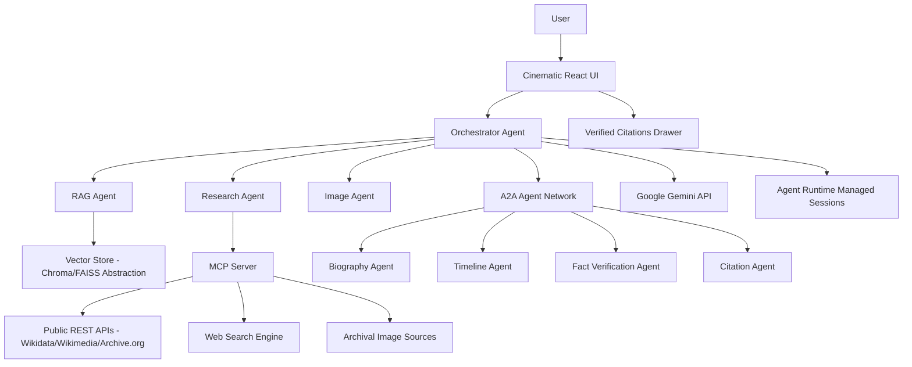

# SWARAJ 1857–1947

### "A Tribute to the Heroes Who Gave India Its Freedom"

[](https://cloud.google.com/vertex-ai)
[](LICENSE)

Created as a production-quality, cinematic Agentic AI historical research and tribute platform dedicated to the Indian freedom struggle from **1857 to 1947**.

Created by **Vimal Sagar Yarraguntla**

> *"Created as a humble digital tribute to the freedom fighters of India, so that their courage, sacrifice and contribution may be remembered by future generations."*

---

## 1. System Architecture



---

## 2. Key Features

- **Cinematic Museum Aesthetic**: Built with React 18, Vite, TypeScript, Tailwind CSS, Framer Motion, dark charcoal backdrop (`#0F0F11`), antique gold accents (`#D4AF37`), parchment cream, and subtle particle grain.
- **Ambient Instrumental Soundscape**: Web Audio API Tanpura/Flute synthesizer with `[MUSIC OFF]` / `[MUSIC ON]` toggle, volume slider, and persistent `localStorage` preference (default OFF).
- **Immersive Opening Sequence**: Animated progression from `1857` ("THE FIRST GREAT SPARKS OF RESISTANCE") to `1947` ("THE DAWN OF INDEPENDENCE") to `SWARAJ 1857–1947`.
- **Ask Swaraj AI Engine**: Natural language historical assistant displaying real-time agent activity steps (*"✓ Understanding question"*, *"✓ Searching RAG"*, *"✓ Calling public sources"*, *"✓ Consulting specialist agents"*, *"✓ Verifying evidence"*, *"✓ Preparing citations"*).
- **Multi-Agent Orchestration (A2A)**: Orchestrator Agent delegating tasks to Biography, Timeline, Research, Image Research, Fact Verification, and Citation specialist agents via typed schemas.
- **Model Context Protocol (MCP)**: Dedicated MCP server exposing controlled tools (`search_wikidata`, `search_wikimedia`, `search_internet_archive`, `retrieve_rag`, `search_person`, `search_event`, `search_location`, `verify_source`, `get_timeline`, `get_sources`).
- **Grounded Citation Engine**: Inline citations `[1]`, `[2]` linked to a source provenance drawer with publisher metadata, retrieval dates, verification status (`SUPPORTED`, `PARTIALLY_SUPPORTED`), and a *"Why this source?"* explanation.
- **AI Visualization Safeguard**: Authentic archival photographs are clearly distinguished from `"AI-generated historical visualizations"`. Real historical portraits are never fabricated.
- **Freedom Fighter Directory**: Categorized directory (National Leaders, Revolutionaries, Women Leaders, Tribal Leaders, Military Leaders, Social Reformers, Regional Leaders) with search and filters by region, era, and movement.
- **Interactive 1857–1947 Timeline**: Milestone timeline covering the 1857 Revolt, INC formation, Partition of Bengal, Swadeshi, Champaran, Jallianwala Bagh, Non-Cooperation, Kakori, Dandi March, Quit India, INA Campaign, and 1947 Independence.
- **Interactive India Hotspot Map**: Stylized map highlighting historical resistance centers (Meerut, Delhi, Jhansi, Champaran, Amritsar, Kakori, Dandi, Mumbai, Kolkata, Andhra agency).

---

## 3. A2A Agent Card Specification

Exposed at `/.well-known/agent-card.json`:
- **Capabilities**: `rag_historical_retrieval`, `public_api_research`, `fact_verification`, `citation_generation`, `timeline_mapping`, `image_provenance_attribution`, `ai_historical_visualization`.
- **Skills**: Biography synthesis, timeline analysis, historical claim verification.

---

## 4. API Endpoints

- `POST /api/chat`: Main agentic RAG and multi-agent endpoint.
- `POST /api/research`: Deep historical research search.
- `GET /api/person/{id}`: Detailed freedom fighter profile.
- `GET /api/event/{id}`: Historical event document.
- `GET /api/location/{id}`: Historical center details.
- `GET /api/search`: Grounded RAG query endpoint.
- `GET /api/timeline`: Chronological event sequence.
- `GET /api/sources`: Bibliography and provenance sources.
- `POST /api/verify`: Fact verification claim checking.
- `GET /api/health`: Health status.
- `GET /.well-known/agent-card.json`: Agent Card metadata.

---

## 5. Local Setup & Execution

### Prerequisites
- Python 3.10+
- Node.js v18+

### Installation & Run

1. **Clone & Setup**:
   ```bash
   cd swaraj-1857-1947
   cp .env.example .env
   ```

2. **Backend Execution**:
   ```bash
   pip install fastapi uvicorn pydantic
   python3 backend/main.py
   ```

3. **Frontend Execution**:
   ```bash
   cd frontend
   npm install
   npm run dev
   ```

4. **Run Unit & E2E Tests**:
   ```bash
   python3 tests/test_swaraj_system.py
   ```

5. **Run Secret Scan**:
   ```bash
   python3 scripts/secret_scan.py
   ```

6. **Agent Runtime Deployment**:
   ```bash
   ./scripts/deploy-agent.sh
   ```

---

## 6. Homage & Dedication

**SWARAJ 1857–1947** is created by **Vimal Sagar Yarraguntla** with gratitude to the freedom fighters of India:

> *"May we remember their courage. May we understand their sacrifices. May we preserve their stories."*
