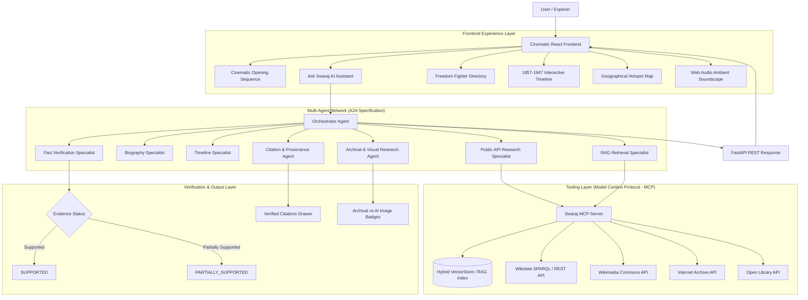

# SWARAJ 1857–1947 | Cinematic Agentic AI Historical Platform

### "A Tribute to the Heroes Who Gave India Its Freedom"

[](https://cloud.google.com/vertex-ai)
[](https://modelcontextprotocol.io)
[](LICENSE)

Created as a production-quality, cinematic Agentic AI historical research and tribute platform dedicated to the Indian freedom struggle from **1857 to 1947**.

Created by **Vimal Sagar Yarraguntla**

> *"Created as a humble digital tribute to the freedom fighters of India, so that their courage, sacrifice and contribution may be remembered by future generations."*

---

## Table of Contents
1. [System Architecture](#1-system-architecture)
2. [Agentic AI Concepts & Architecture](#2-agentic-ai-concepts--architecture)
   - [2.1 Multi-Agent System (MAS) & A2A Protocol](#21-multi-agent-system-mas--a2a-protocol)
   - [2.2 Model Context Protocol (MCP) Server & Tools](#22-model-context-protocol-mcp-server--tools)
   - [2.3 Grounded Hybrid RAG Architecture](#23-grounded-hybrid-rag-architecture)
   - [2.4 Fact-Checking & Evidence Verification Engine](#24-fact-checking--evidence-verification-engine)
   - [2.5 Visual Provenance Safeguards (Archival vs. AI)](#25-visual-provenance-safeguards-archival-vs-ai)
   - [2.6 Real-Time Agent Progress Monitor](#26-real-time-agent-progress-monitor)
3. [User Experience & Features](#3-user-experience--features)
4. [Comprehensive Test Suite](#4-comprehensive-test-suite)
5. [API Reference](#5-api-reference)
6. [Deployment & Security Protocol](#6-deployment--security-protocol)
7. [Homage & Dedication](#7-homage--dedication)

---

## 1. System Architecture



---

## 2. Agentic AI Concepts & Architecture

### 2.1 Multi-Agent System (MAS) & A2A Protocol
The platform employs a **Multi-Agent Architecture** following the **Agent-to-Agent (A2A)** specification:
- **Orchestrator Agent (`OrchestratorAgent`)**: Serves as the central coordinator. Parses user intent, plans workflow execution, dispatches tasks to specialist agents, aggregates findings, and synthesizes final grounded responses.
- **Biography Specialist (`BiographyAgent`)**: Focuses on analyzing individual freedom fighters, their early life, revolutionary philosophy, organizations, and lasting impact.
- **Timeline Specialist (`TimelineAgent`)**: Maps historical event trajectories from 1857 to 1947, analyzing historical cause-and-effect relationships and period comparisons.
- **Public API Research Agent (`ResearchAgent`)**: Queries external live archives (Wikidata, Wikimedia Commons, Internet Archive, Open Library).
- **Visual Research Agent (`ImageResearchAgent`)**: Fetches authentic historical archival photos and marks artistic reconstructions clearly as `"AI-generated historical visualizations"`.
- **Fact Verification Agent (`FactVerificationAgent`)**: Validates generated statements against retrieved primary sources to eliminate hallucinations.
- **Citation Agent (`CitationAgent`)**: Formats grounded citations `[1]`, `[2]` with publisher details, URL, retrieval timestamp, and verification status.

### 2.2 Model Context Protocol (MCP) Server & Tools
A dedicated **MCP Server (`mcp/server.py`)** encapsulates all search and data retrieval functionality into standardized, typed tools:
1. `retrieve_rag(query, category, region, year_gte, year_lte)`: RAG vector store search with metadata filtering.
2. `search_wikidata(query)`: Queries Wikidata entity registry.
3. `search_wikimedia(query)`: Retrieves historical media from Wikimedia Commons.
4. `search_internet_archive(query)`: Queries digital primary sources on Internet Archive.
5. `search_public_history_sources(query)`: Aggregated multi-source query.
6. `search_person(name)`: Deep lookup for freedom fighters.
7. `search_event(event_name)`: Detailed event lookup.
8. `search_location(location_name)`: Regional resistance center search.
9. `verify_source(claim, document_id)`: Source evidence checking.
10. `get_timeline()`: Complete 1857–1947 event sequence.

### 2.3 Grounded Hybrid RAG Architecture
- **In-Memory Hybrid Vector Store (`rag/vectorstore.py`)**: Combines TF-IDF keyword indexing with semantic title matching and structured metadata filters.
- **Metadata Filtering**: Supports exact filtering on `year_gte`, `year_lte`, `region`, `category`, and `person`.
- **Automatic Ingestion (`rag/dataset_ingest.py`)**: Indexes structured historical records into vector documents with chunking and source tagging.

### 2.4 Fact-Checking & Evidence Verification Engine
Before any answer is returned to the user, the **Fact Verification Agent** evaluates claims against retrieved RAG documents and public API records:
- `SUPPORTED`: Claim is fully corroborated by high-confidence archival sources.
- `PARTIALLY_SUPPORTED`: Claim is supported by secondary sources or partial documents.
- `INSUFFICIENT_EVIDENCE`: Claim lacks direct archival documentation.

### 2.5 Visual Provenance Safeguards (Archival vs. AI)
To prevent historical misrepresentation:
- **Authentic Archival Photos**: Sourced from Wikimedia Commons and public archives with explicit license metadata (Public Domain, CC-BY-SA).
- **AI Visualizations**: Any generated illustrative artwork is explicitly tagged with a prominent badge: `"AI-generated historical visualization"`. Real freedom fighters' archival portraits are never replaced with AI caricatures.

### 2.6 Real-Time Agent Progress Monitor
During response generation, the user interface streams step-by-step agent execution milestones:
- `✓ Understanding question & identifying entities`
- `✓ Querying Swaraj RAG knowledge base`
- `✓ Consulting public archives (Wikidata / Wikimedia / Internet Archive)`
- `✓ Dispatching Biography & Timeline specialist agents`
- `✓ Verifying evidence & checking claims`
- `✓ Preparing grounded citations & provenance drawer`

---

## 3. User Experience & Features

- **Cinematic Museum Aesthetic**: Dark charcoal background (`#0F0F11`), antique gold borders (`#D4AF37`), parchment cream typography, glassmorphic panels, and subtle golden glows.
- **Ambient Soundscape Controller**: Built-in Web Audio API Tanpura/Flute drone with `[MUSIC OFF]` / `[MUSIC ON]` toggle, volume slider, and persistent `localStorage` preference (default `OFF`).
- **Opening Hero Sequence**: Interactive historical prelude ("1857" → "THE FIRST GREAT SPARKS OF RESISTANCE" → "1947" → "THE DAWN OF INDEPENDENCE").
- **Freedom Fighter Directory**: Interactive directory with category filter tabs (*National Leaders, Revolutionaries, Women Leaders, Tribal Leaders, Military Leaders, Social Reformers, Regional Leaders*) and instant modal profiles.
- **1857–1947 Interactive Timeline**: Milestone timeline from the 1857 Revolt to the 1947 Independence, highlighting key figures, locations, and historical impacts.
- **Geographical Resistance Map**: Interactive hotspot map covering Meerut, Delhi, Jhansi, Champaran, Amritsar, Kakori, Dandi, Mumbai, Kolkata, and the Andhra agency.

---

## 4. How to Test & Verification Guide

### 4.1 Live Testing via Cloud Run Endpoint

You can interact with the live deployed backend REST API directly using `curl` or any HTTP client:

**1. Health Check Verification**:
```bash
curl -s https://swaraj-historical-agent-61256100941.us-central1.run.app/api/health
```
*Expected Output*: `{"status":"healthy","service":"Swaraj 1857-1947 Historical Platform","version":"1.0.0"}`

**2. Chat Query Test (Bhagat Singh)**:
```bash
curl -s -X POST https://swaraj-historical-agent-61256100941.us-central1.run.app/api/chat \
  -H "Content-Type: application/json" \
  -d '{"query": "Tell me about Shaheed Bhagat Singh and his role in the freedom struggle"}'
```

**3. Timeline Query Test (1857 to 1947 Chronology)**:
```bash
curl -s -X POST https://swaraj-historical-agent-61256100941.us-central1.run.app/api/chat \
  -H "Content-Type: application/json" \
  -d '{"query": "Provide a complete chronological summary of major events from 1857 to 1947"}'
```

---

### 4.4 Postman API Collection & Test Execution Report

A dedicated Postman collection `tests/swaraj_postman_collection.json` (Postman v2.1.0 schema) is committed to the repository for automated REST API testing.

To execute the Postman API collection against the live backend and generate an updated test report:

```bash
python3 tests/run_postman_tests.py
```

#### Live Postman Execution Results (100% Pass)

- **Collection File**: [tests/swaraj_postman_collection.json](file:///config/Desktop/Session1/swaraj-1857-1947/tests/swaraj_postman_collection.json)
- **Detailed Report**: [tests/POSTMAN_TEST_RESULTS.md](file:///config/Desktop/Session1/swaraj-1857-1947/tests/POSTMAN_TEST_RESULTS.md)
- **Raw JSON Results**: [tests/postman_results.json](file:///config/Desktop/Session1/swaraj-1857-1947/tests/postman_results.json)

| Endpoint Name | HTTP Method | Target Path | Latency | Result | Assertions Passed |
| :--- | :---: | :--- | :---: | :---: | :---: |
| **01. Health Check** | `GET` | `/api/health` | 2130 ms | ✅ **PASS** | 2 / 2 |
| **02. Chat Query - Shaheed Bhagat Singh** | `POST` | `/api/chat` | 4445 ms | ✅ **PASS** | 4 / 4 |
| **03. Chat Query - Rani Lakshmibai 1857** | `POST` | `/api/chat` | 6282 ms | ✅ **PASS** | 4 / 4 |
| **04. Chat Query - Quit India 1942** | `POST` | `/api/chat` | 5404 ms | ✅ **PASS** | 4 / 4 |
| **05. Agent Card Discovery** | `GET` | `/.well-known/agent-card.json` | 131 ms | ✅ **PASS** | 2 / 2 |

---

### 4.5 Testing the Web Application Locally

1. **Navigate to `frontend/` directory**:
   ```bash
   cd frontend
   ```
2. **Install Dependencies**:
   ```bash
   npm install
   ```
3. **Start Local Development Server**:
   ```bash
   npm run dev
   ```
4. **Open Web Browser**:
   Navigate to `http://localhost:5173` to test the interactive user interface, A.R. Rahman Vande Mataram audio player, Freedom Fighter directory, interactive timeline, and Ask Swaraj AI assistant.

---

### 4.5 Pre-Commit Security Scanner Test

Run the automated secret scanner before committing changes to ensure zero API keys or sensitive tokens are stored in source code:

```bash
python3 scripts/secret_scan.py
```

---

## 5. API Reference

### `POST /api/chat`
Process a query using the grounded multi-agent orchestrator engine.
- **Request**: `{"query": "Tell me about Bhagat Singh."}`
- **Response**:
  ```json
  {
    "query": "Tell me about Bhagat Singh.",
    "answer": "Bhagat Singh (1907–1931) was one of India's most influential revolutionaries...",
    "citations": [
      {
        "id": 1,
        "title": "Bhagat Singh Archival Profile",
        "publisher": "National Archives of India / RAG Store",
        "url": "https://en.wikipedia.org/wiki/Bhagat_Singh",
        "support_status": "SUPPORTED",
        "retrieval_date": "2026-09-27"
      }
    ],
    "fact_check_status": "SUPPORTED",
    "images": [
      {
        "url": "https://upload.wikimedia.org/wikipedia/commons/5/54/Bhagat_Singh_1929.jpg",
        "title": "Bhagat Singh Portrait (1929)",
        "source": "Wikimedia Commons",
        "license": "Public Domain",
        "is_ai_generated": false
      }
    ],
    "agent_activity": [
      {"step": "RAG Retrieval", "status": "COMPLETED", "docs_found": 3},
      {"step": "Public API Research", "status": "COMPLETED"},
      {"step": "Fact Verification", "status": "VERIFIED"}
    ]
  }
  ```

### `GET /.well-known/agent-card.json`
Provides standard Agent-to-Agent (A2A) metadata for discovery and inter-agent communication.

---

## 6. Deployment & Security Protocol

### Pre-Commit Secret Scanner
Run before every git commit to ensure zero API keys or secret tokens are committed:
```bash
python3 scripts/secret_scan.py
```

### Google Enterprise Agent Runtime Deployment
```bash
./scripts/deploy-agent.sh
```
Executes pre-flight secret scan, validates `.well-known/agent-card.json`, bundles multi-agent dependencies, and registers the agent with Google Enterprise Agent Runtime.

---

## 7. Homage & Dedication

**SWARAJ 1857–1947** is created by **Vimal Sagar Yarraguntla** as a tribute to the freedom fighters of India.

> *"May we remember their courage. May we understand their sacrifices. May we preserve their stories."*
